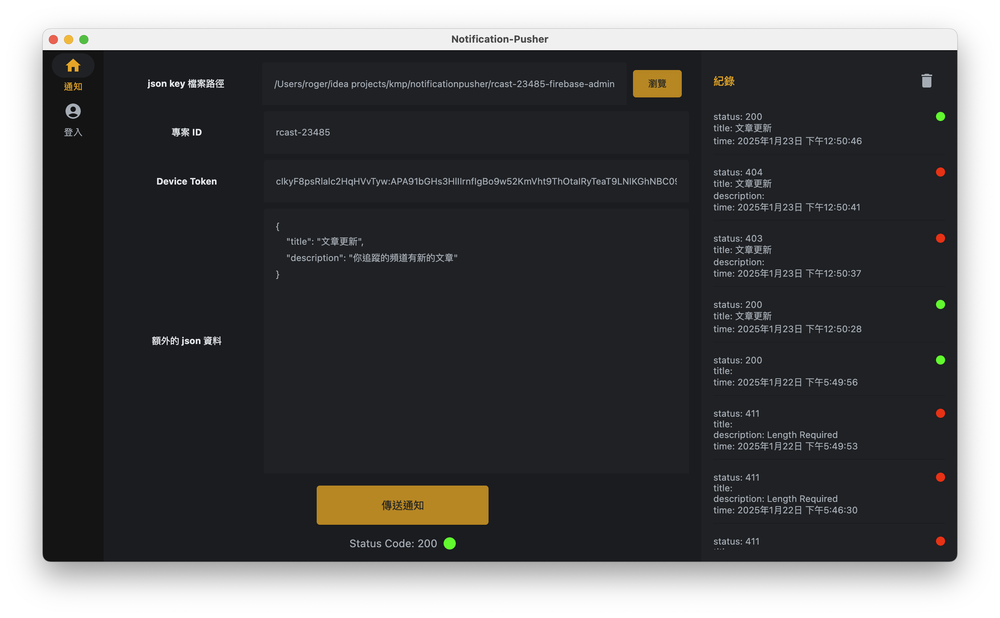

# 推播測試工具 (Kotlin Multiplatform Desktop)

這是一個推播測試工具，使用 **Kotlin Multiplatform for Desktop** 技術所打造。它可以協助你更方便地測試手機的推播通知 (iOS 推播還在進行中)，提供簡潔易用的 GUI，不必再透過繁複的命令列或自行搭建伺服器即可驗證推播功能。

> **hint**：本工具會提供一個 macOS 版本的 `.dmg` 檔案，可以直接下載並安裝使用。

[<a href="url"></a>](https://drive.google.com/file/d/1D7VxVcG9O2NOk2M_9F1BIEz3vHQjkKZi/view?usp=sharing)
---

## 功能特色

1. **跨平台支援**  
   - 使用 Kotlin Multiplatform for Desktop，可原生執行於多種作業系統。

2. **多種推播方式**    
   - Android (FCM)  
     - 支援 **Service Account Json** 驗證
   - iOS (APNs)  
     - TODO

3. **GUI 介面**  
   - 不必自行撰寫驗證測試推播

4. **自動保存部分設定**  
   - 自動保存已填寫的文字欄位（例如 Project ID、Device Token、Server Key...等）。  

5. **靈活編輯推播內容**  
   - 支援自定義推播 Payload，能更自由地測試各種通知內容。

---

## 安裝

### macOS

- **下載 [`.dmg`](https://drive.google.com/file/d/1D7VxVcG9O2NOk2M_9F1BIEz3vHQjkKZi/view?usp=sharing) 檔案** 

- **macOS Catalina (10.15+) 以上版本啟動提醒**  
  - 如果第一次啟動時系統出現安全性警告，請至「系統偏好設定」→「安全性與隱私」→「一般」(General) 分頁，點選「仍要開啟」(Open Anyway) 以允許執行。  
  - macOS Ventura 或更新版本則會在「系統設定」→「隱私與安全性」→「一般」分頁中顯示相同提示。

---

## 使用方式

### 2. Android 推播 (FCM)

- 前往 [Firebase Console](https://console.firebase.google.com/) 建立或選擇已有的專案。  
- 進入專案設定 -> 服務帳戶 -> 產生新的私密金鑰。  
- 在本工具的 Android 設定頁面中填入 **json Key path**、**Device Token**，以及推播訊息 (需符合 JSON 格式)。  
- 選擇送出，即可測試推送到指定的 Android 裝置。

---

## 範例推播內容 (JSON Payload)

以下範例為 Android 常見的結構，可自行依需求客製化：

Android FCM 也可支援自定義欄位，例如：
```json
{
  "token": "token value",
  "data": {
    "customKey": "customValue"
  }
}
```

---

<a href="buymeacoffee.com/rogerchang">
		
	</a>
